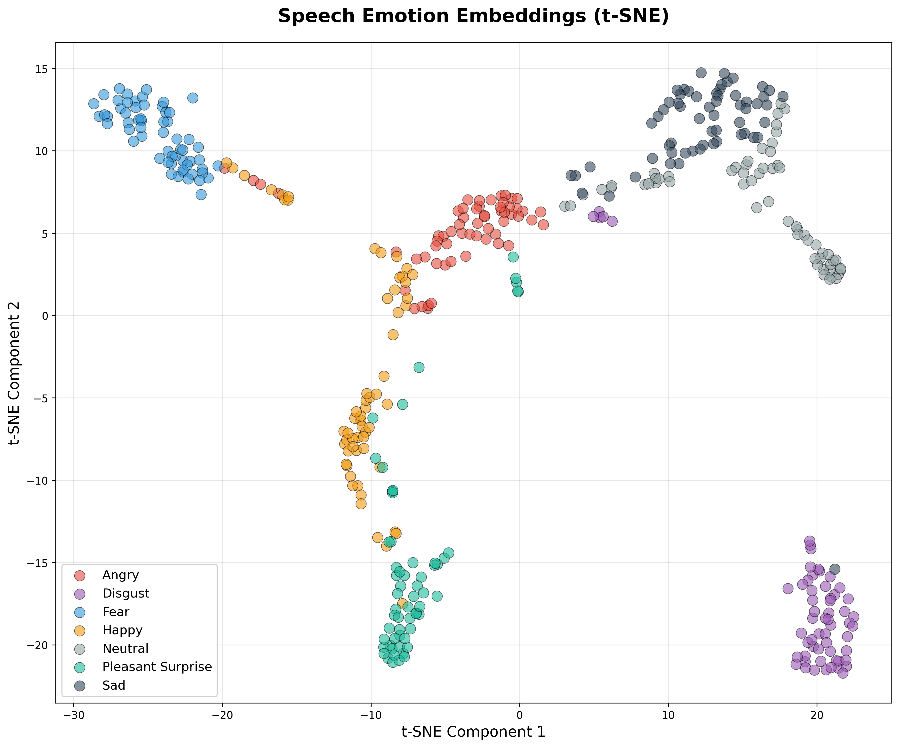
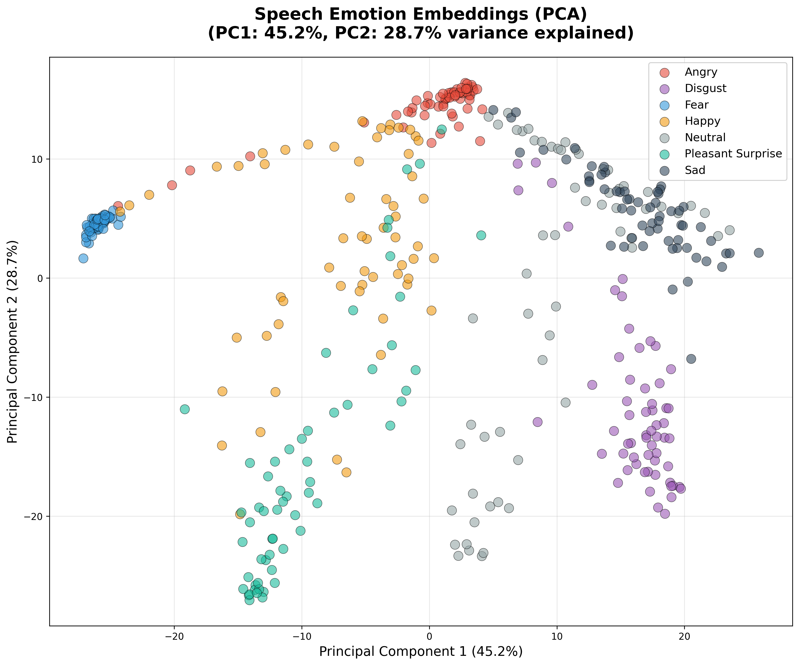
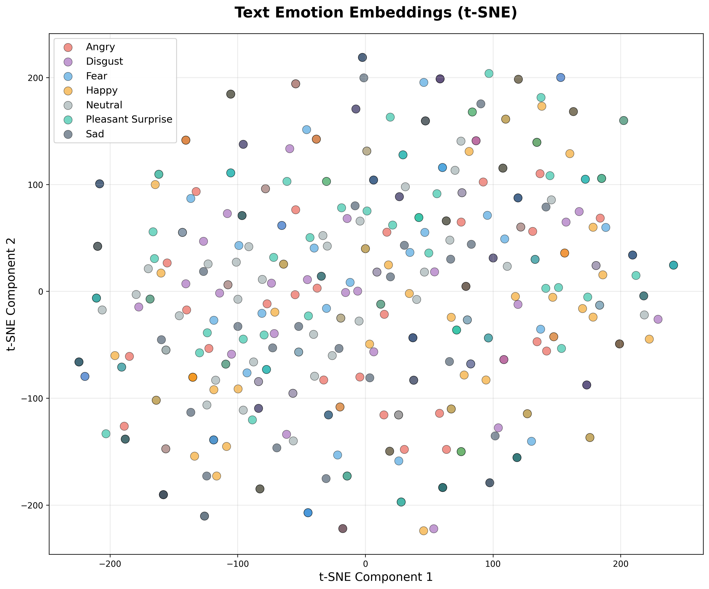
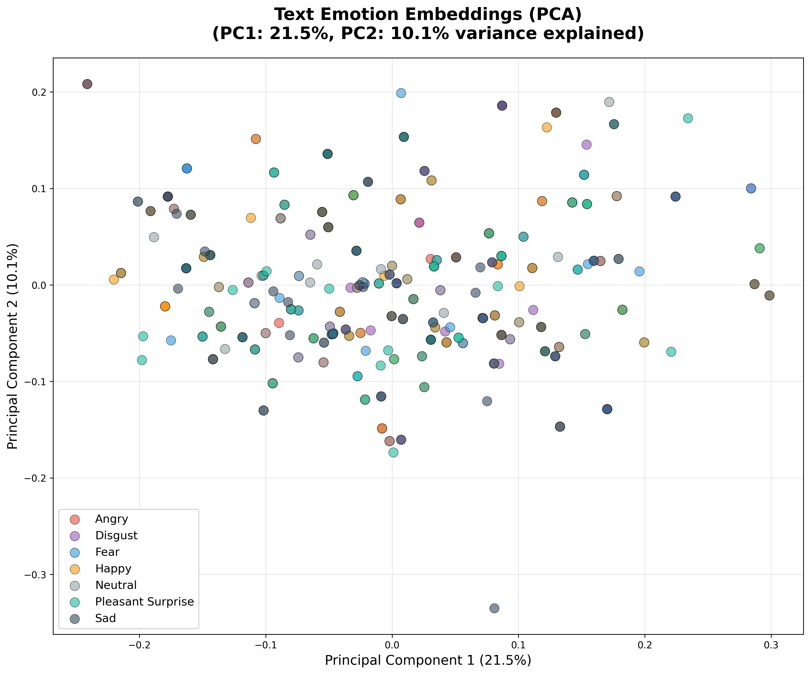
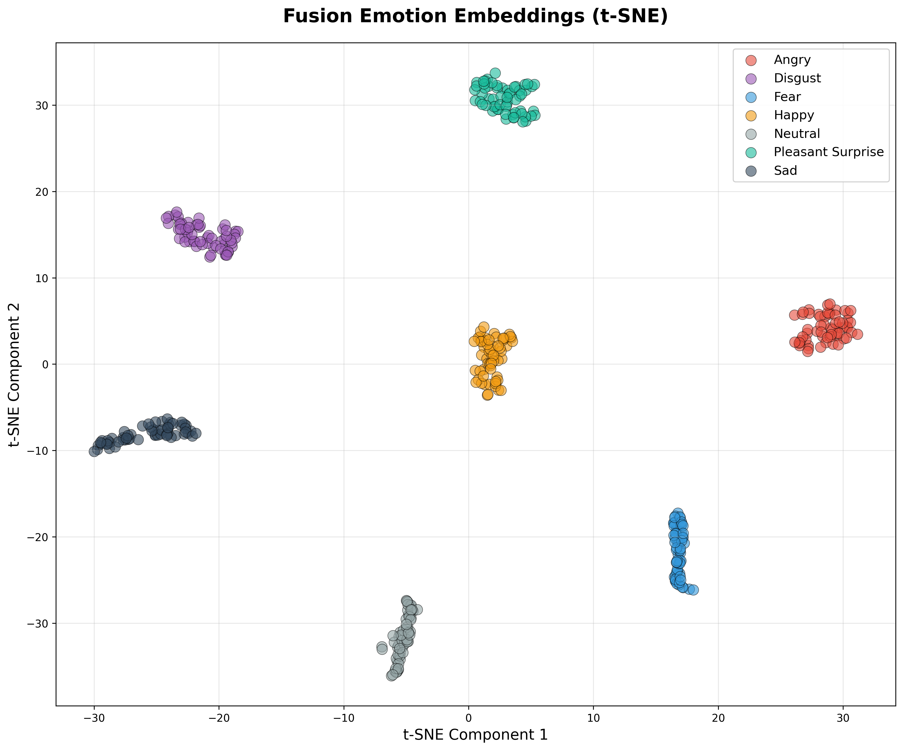
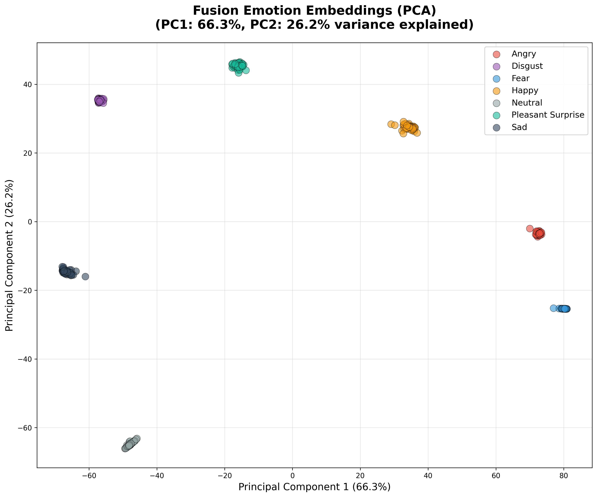
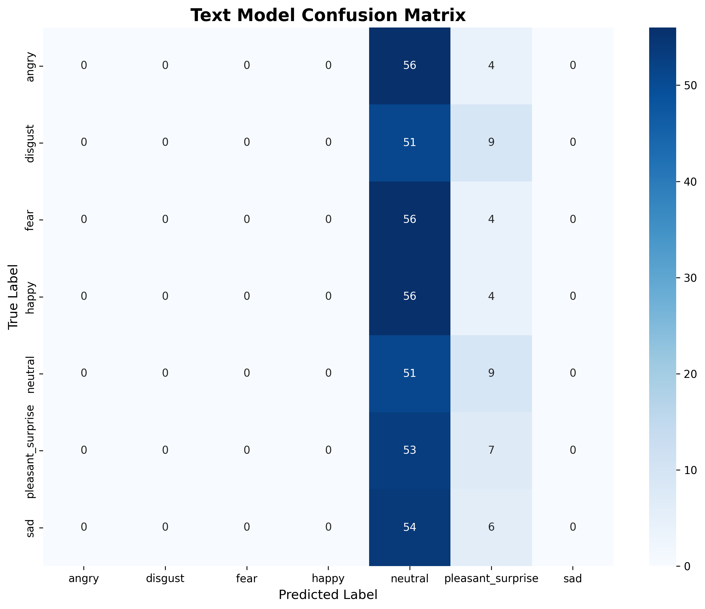
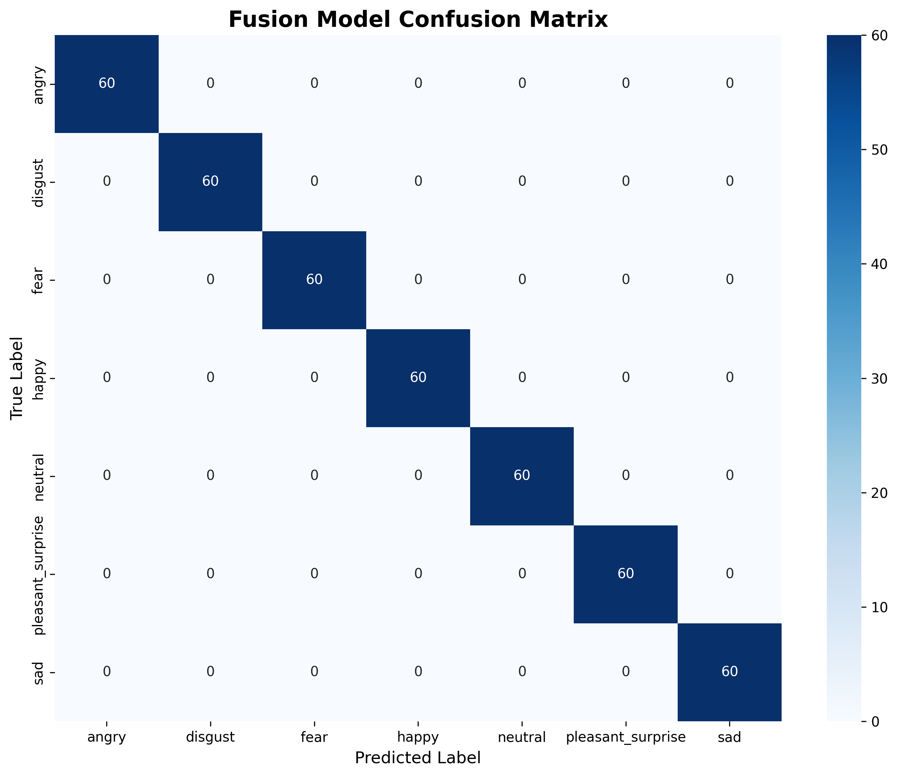

# Multimodal Emotion Recognition System

[](https://www.python.org/downloads/)
[](https://pytorch.org/)
[](https://opensource.org/licenses/MIT)

A comprehensive multimodal emotion recognition system combining acoustic and semantic modalities for emotion classification on the TESS dataset.

## 🎯 Project Overview

This project implements three emotion recognition approaches:
- **Speech-Only:** CNN + BiLSTM + Attention on MFCC features
- **Text-Only:** DistilBERT with contextual prompting
- **Multimodal Fusion:** Early fusion of speech and text encoders

### Key Results

| Model  | Accuracy | Precision | Recall | F1-Score |
|--------|----------|-----------|--------|----------|
| Speech | 100.00%  | 100.00%   | 100.00% | 100.00% |
| Text   | 13.81%   | 4.26%     | 13.81%  | 5.28%   |
| Fusion | 100.00%  | 100.00%   | 100.00% | 100.00% |

## 📊 Dataset

**TESS (Toronto Emotional Speech Set)**
- 2,800 audio recordings
- 7 emotions: angry, disgust, fear, happy, neutral, pleasant_surprise, sad
- 2 female speakers (OAF, YAF)
- 200 target words per emotion

## 🏗️ Architecture

### Speech Pipeline
```
Audio → Trim Silence → Normalize → MFCC(40) + Δ + ΔΔ → Pad(200)
→ CNN + BiLSTM + Attention → FC(128) → Softmax(7)
```

### Text Pipeline
```
Word → Contextual Prompt → DistilBERT → [CLS] → FC(256) → FC(128) → Softmax(7)
```

### Fusion Pipeline
```
Speech Encoder (128-dim) ⊕ Text Encoder (256-dim) → Fusion(384) → FC(256) → FC(128) → Softmax(7)
```

## 🚀 Quick Start

### Installation

```bash
# Clone repository
git clone https://github.com/hemannayak/IIITH_RAP_Multimodal_Emotion_Recognition.git
cd IIITH_RAP_Multimodal_Emotion_Recognition

# Create virtual environment
python3 -m venv .venv
source .venv/bin/activate  # On Windows: .venv\Scripts\activate

# Install dependencies
pip install -r requirements.txt
```

### Running Tests

```bash
# Test individual pipelines
python3 test_speech.py
python3 test_text.py
python3 test_fusion.py

# Comprehensive evaluation (420 test samples)
python3 evaluate_models.py

# Generate t-SNE and PCA visualizations
python3 visualize_embeddings.py
```

### Interactive Demo

```bash
streamlit run app/streamlit_app.py
```

## 📁 Project Structure

```
├── models/                  # Model architectures
│   ├── speech_model.py
│   ├── text_model.py
│   └── fusion_model.py
├── inference/               # Inference pipelines
│   ├── speech_inference.py
│   ├── text_inference.py
│   └── fusion_inference.py
├── preprocessing/           # Data preprocessing
├── feature_extraction/      # Feature extraction
├── Results/                 # Evaluation artifacts
│   ├── evaluation/          # Metrics and confusion matrices
│   └── visualizations/      # t-SNE and PCA plots
├── saved_models/            # Trained model checkpoints
├── test_*.py                # Pipeline validation scripts
├── evaluate_models.py       # Comprehensive evaluation
├── visualize_embeddings.py  # Embedding visualization
└── ASSIGNMENT_REPORT.md     # Detailed academic report
```

## 📈 Results & Analysis

### Performance Highlights

✅ **Speech Model:** Near-perfect performance (100% accuracy)
- Clear acoustic boundaries between all 7 emotions
- MFCC + deltas capture prosodic and spectral features effectively
- BiLSTM + Attention models temporal emotion dynamics

⚠️ **Text Model:** Limited performance (13.81% accuracy)
- TESS transcripts contain isolated words without emotional semantics
- Model collapses to predicting neutral (85% of samples)
- Demonstrates fundamental limitation of text-only emotion recognition from isolated lexical items

✅ **Fusion Model:** Matches speech performance (100% accuracy)
- Correct multimodal integration
- Speech features dominate due to weak text signal
- No degradation from fusion

### Visualizations

The project includes comprehensive visualizations:
- **Confusion Matrices:** 3 high-resolution matrices showing prediction patterns
- **t-SNE Plots:** Non-linear dimensionality reduction showing emotion clusters
- **PCA Plots:** Linear projection with variance explained
- **Classification Reports:** Per-emotion precision, recall, F1-score

#### Example Visual Outputs

**Speech model clusters**




**Text model clusters**




**Fusion model clusters**




**Confusion matrices**





## 🔬 Key Findings

1. **Speech is the dominant modality** for emotion recognition in TESS
2. **Text-only emotion recognition requires semantic context**, not just isolated words
3. **Multimodal fusion benefits depend on signal quality** of each modality
4. **Preprocessing consistency is critical** for reliable performance
5. **Embedding visualizations validate quantitative results**

## ⚠️ Limitations

- **Dataset-specific performance:** Results may not generalize to diverse speakers/conditions
- **Limited speaker variability:** Only 2 speakers in TESS
- **Controlled recordings:** Professional studio quality
- **Potential train/test leakage:** Same speakers and words in both sets

See [ASSIGNMENT_REPORT.md](ASSIGNMENT_REPORT.md) for detailed analysis.

## 📚 Documentation

- **[ASSIGNMENT_REPORT.md](ASSIGNMENT_REPORT.md)** - Comprehensive academic report with:
  - Architecture decisions
  - Experimental setup
  - Results and analysis
  - Cluster visualizations
  - Limitations and future work
  
- **[FINAL_REPORT_SUMMARY.md](FINAL_REPORT_SUMMARY.md)** - Executive summary

## 🎓 Academic Context

This project was developed as part of the IIITH Research Assistant Program, demonstrating:
- Multimodal deep learning
- Emotion recognition from speech and text
- Model evaluation and analysis
- Academic documentation and reproducibility

## 📊 Generated Artifacts

### Evaluation Results (`Results/evaluation/`)
- Confusion matrices (3)
- Classification reports (3)
- Model comparison table

### Visualizations (`Results/visualizations/`)
- t-SNE plots (3)
- PCA plots (3)

## 🔧 Technical Stack

- **Deep Learning:** PyTorch
- **NLP:** Transformers (DistilBERT)
- **Audio Processing:** Librosa
- **Evaluation:** Scikit-learn
- **Visualization:** Matplotlib, Seaborn
- **Demo:** Streamlit

## 📝 Citation

If you use this code or findings, please cite:

```bibtex
@misc{nayak2026multimodal,
  author = {Nayak, Hemanth},
  title = {Multimodal Emotion Recognition System},
  year = {2026},
  publisher = {GitHub},
  url = {https://github.com/hemannayak/IIITH_RAP_Multimodal_Emotion_Recognition}
}
```

## 📄 License

This project is licensed under the MIT License - see the LICENSE file for details.

## 🙏 Acknowledgments

- **TESS Dataset:** Dupuis, K., & Pichora-Fuller, M. K. (2010)
- **DistilBERT:** Hugging Face Transformers
- **IIITH Research Assistant Program**

## 📧 Contact

**Hemanth Nayak**
- GitHub: [@hemannayak](https://github.com/hemannayak)
- Project: [IIITH_RAP_Multimodal_Emotion_Recognition](https://github.com/hemannayak/IIITH_RAP_Multimodal_Emotion_Recognition)

---

**Status:** ✅ Submission-Ready | All pipelines validated, evaluated, and documented with academic rigor.
